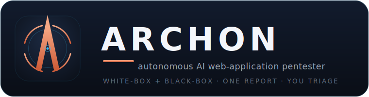

<!-- ══════════════════════════════════════════════════════════════════════ -->
<!--  ARCHON · README                                                        -->
<!--  Images live in ./assets/ — keep them next to this file (repo: /assets) -->
<!-- ══════════════════════════════════════════════════════════════════════ -->

<p align="center">
  
</p>

<p align="center">
  <b>Autonomous Research &amp; Code Hunting for Offensive Networks</b><br>
  One operator dispatches a full squad of AI security specialists — recon, exploitation,
  verification, and reporting — and triages the results.
</p>

<p align="center">
  
  
  
  
  
</p>

<p align="center">
  <a href="#-quickstart">Quickstart</a> ·
  <a href="#-how-it-works">How it works</a> ·
  <a href="#-the-console">The console</a> ·
  <a href="#-squads--agents">Squads</a> ·
  <a href="#-triage--reporting">Triage</a> ·
  <a href="#-responsible-use">Responsible use</a>
</p>

---

## What is ARCHON?

ARCHON turns a single security engineer into the operator of an autonomous red team. You point
it at a target (black-box) or a codebase (white-box), and a **lead agent plans the attack** and
**dispatches specialist agents in parallel waves**. Every candidate finding is independently
**verified** before it reaches you, scored with **CVSS 3.1**, and rolled up into one
de-duplicated report — with **you** as the final triage gate.

- 🛰️ **One operator, a full squad** — ATLAS plans; SCOUT/RANGER recon; VIPER/DRILL/WARDEN/… attack; AUDITOR verifies; SCRIBE reports.
- ✅ **Every finding independently verified** — no wall of unconfirmed scanner noise.
- 🎯 **Black-box, static, or white-box** — live target, source review, or both merged into one report.
- 🧮 **CVSS 3.1 built in** — an interactive calculator on every finding; you keep the final say.
- 🔒 **Fail-closed scope gate** — out-of-scope hosts are rejected at Phase 0, before any traffic.
- 🖥️ **Zero-build console** — plain HTML/CSS/JS served by a small Node daemon. No framework, no bundler.
- 🧾 **Runs on your Claude subscription** — bring your own model access.

<p align="center">
  
</p>

---

## 🚀 Quickstart

```bash
# 1 · clone
git clone https://github.com/ghostshift-content/ARCHON.git
cd ARCHON

# 2 · one-shot setup — installs deps, seeds the local data layer (var/intel) the daemon
#     needs to boot, and runs a preflight (Node, your Claude login, optional recon tools)
bash setup.sh

# 3 · start the two processes, in separate shells
npm start            # the agent daemon      → node event-bus.js
npm run dashboard    # the operator console  → node scripts/dashboard.js  (http://localhost:4000)

# 4 · open the console
open http://127.0.0.1:4000
```

Then click **New dispatch**, choose a squad, enter your **in-scope** target, and watch the run
stream: dispatch → recon → specialist waves → verification → report.

**Requirements:** Node ≥ 18 · the **Claude CLI, logged in** — ARCHON runs on your Claude
**subscription** via OAuth, no API key · targets you are **authorised** to test. Optional recon
tools (nmap, ffuf, …) sharpen black-box runs; `npm run doctor` reports what's present.
_(The console honours `PORT=` to override 4000.)_

---

## 🧠 How it works

ARCHON runs every engagement as a phased pipeline. The lead agent fans work out to specialists,
then funnels every candidate through verification and judgement before you triage:

```
        ┌─────────┐
        │  ATLAS  │  lead · plans the attack walk
        └────┬────┘
   ┌────┬────┼────┬────┬────┐        parallel specialist waves
 SCOUT VIPER DRILL WARDEN RELAY GATEWAY   (recon · XSS · SQLi · IDOR · SSRF · API …)
   └────┴────┼────┴────┴────┘
        ┌────▼────┐
        │ AUDITOR │  verifies every candidate finding
        └────┬────┘
        ┌────▼────┐
        │ ARBITER │  judges severity · promotes / downgrades
        └────┬────┘
        ┌────▼────┐
        │ SCRIBE  │  one de-duplicated report  ──►  YOU triage
        └─────────┘
```

**Phases:** `0` scope pre-validate (fail-closed) → `0.4` port/service scan (naabu→nmap) →
`1` recon (surface, JS bundles, endpoints) → `2` specialist waves → `3.x` verification + judge +
chain analysis → `4` report.

> 💡 Prefer an animated version for the top of the README? Record
> `assets/archon-logo-animated.svg` (or your dashboard demo) to a GIF and embed it here —
> GitHub strips SVG animation from ``, so a GIF is the reliable way to show motion.

---

## 🖥️ The console

A zero-build single-page app served by `scripts/dashboard.js` — plain HTML/CSS/JS, no framework.

| View | What it does |
|---|---|
| **Overview** | Live ops: active/queued/completed tasks, self-verifying system health, live activity. |
| **Tasks** | Every run as a card — live phase, progress, squad dispatch, cost & model routing. |
| **Run detail** | Per-run Overview (dispatch → report), streaming **Findings**, **Testing logs**, and the **Report**. |
| **New dispatch** | Queue work: black-box / static / white-box, scope, focus classes, test accounts. |
| **Squads** | The rosters — leaders, phases, and every persona. |
| **Reports** | Final published dossiers. |

---

## 🛰️ Squads &amp; agents

- **pentest** — lead **ATLAS**. Black-box / white-box web application testing.
- **code-review** — lead **CURATOR**. White-box source review (stack-agnostic feature discovery).
- **universal** — cross-squad services: **AUDITOR** (verify), **ARBITER** (judge), **SCRIBE** (report), **TRIAGER**.

Specialists map to vulnerability classes — e.g. **WARDEN** (access-control / IDOR), **VIPER** (XSS),
**DRILL** (SQLi), **RELAY** (SSRF), **GATEWAY** (API / JWT), **SCOUT** / **RANGER** (recon). Each run
shows its exact roster and the model routed to each agent.

---

## 🧮 Triage &amp; reporting

- **You are the final gate.** Every verified finding lands on a board; you **Confirm** or **Reject**.
- **CVSS 3.1 calculator** on each finding — pick the metrics, score + vector update live, severity
  follows (override when you need to).
- **Enrich** fills description / impact / remediation / raw request; **Generate report** writes one
  de-duplicated dossier of the confirmed findings.
- **Iterations** — re-run the same engagement with a new focus; results append, nothing is lost.

---

## 🔒 Responsible use

ARCHON is an **offensive** security tool. Only test systems you **own** or have **explicit written
authorisation** to assess. The fail-closed scope gate rejects out-of-scope hosts at Phase 0, but
scope is ultimately your responsibility. Unauthorised testing is illegal in most jurisdictions.

> Examples in this project use OWASP Juice Shop, an intentionally vulnerable app. Target hosts are
> shown as `<ip>` throughout the docs.

---

## 📚 Docs

- **[SETUP-LOCAL.md](SETUP-LOCAL.md)** — environment, portable roots, and first-run detail.
- **[OPERATOR-RUNBOOK.md](OPERATOR-RUNBOOK.md)** — authorise → dispatch → read the report.
- **[benchmark/](benchmark/README.md)** — how ARCHON is evaluated · **[CLAUDE.md](CLAUDE.md)** — architecture, for contributors.

## 🤝 Contributing

Issues and PRs welcome — see [`CONTRIBUTING.md`](CONTRIBUTING.md).

## 📄 License

**MIT** — see [`LICENSE`](LICENSE). © 2026 ARCHON contributors.

<p align="center"><sub>Every finding independently verified · you triage · runs on your Claude subscription</sub></p>
