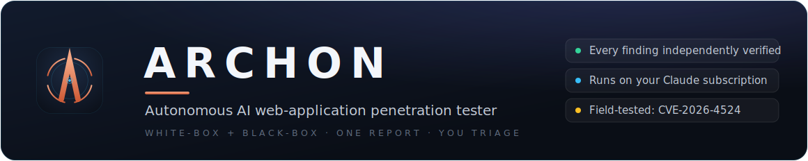
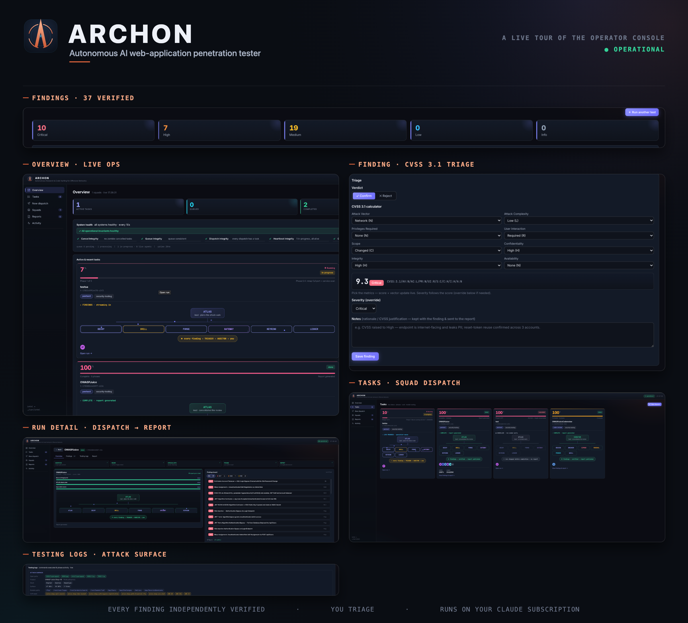
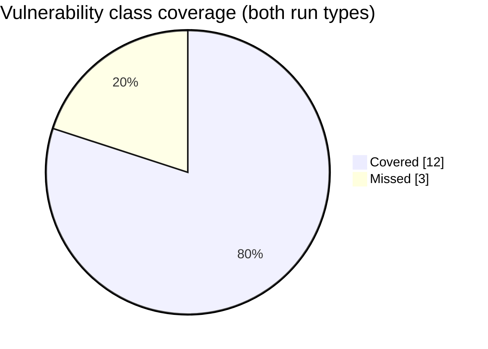

<div align="center">



**Autonomous AI web-application penetration tester — white-box + black-box in one engagement.**

ARCHON runs a squad of LLM-powered specialist agents against a web target, independently verifies
every finding, stops for your triage, and writes a professional report. Give it a **URL** for a
black-box assessment, or a **URL + source code** for a combined white-box + black-box engagement
whose findings merge into one de-duplicated report.

[](./LICENSE)
[](https://github.com/ghostshift-content/ARCHON/actions/workflows/ci.yml)
[](https://nodejs.org)
[-d97757.svg)](https://claude.ai/code)
[](./BACKLOG.md)
[](https://www.cve.org/CVERecord?id=CVE-2026-4524)

</div>

<p align="center"></p>

> ⚠️ **Authorized testing only.** Only test systems you own or have explicit written permission to
> assess. ARCHON fails *closed* on missing scope and never fires impact-proving exploits by default,
> but **you** are responsible for staying within scope and the law.

---

## Table of contents

- [Why ARCHON](#why-archon)
- [Features](#features)
- [How it works](#how-it-works)
- [How the agents and triage work](#how-the-agents-and-triage-work)
- [Benchmark](#benchmark)
- [Field-tested — a real CVE](#field-tested--a-real-cve)
- [Engagement modes](#engagement-modes)
- [The squads](#the-squads)
- [Quickstart](#quickstart)
- [Authentication — subscription, not API key](#authentication--subscription-not-api-key)
- [Usage](#usage)
- [Configuration](#configuration)
- [Project structure](#project-structure)
- [Safety & scope](#-safety--scope)
- [Testing](#testing)
- [Development & contributing](#development--contributing)
- [Documentation](#documentation)
- [Roadmap & status](#roadmap--status)
- [License](#license)

---

## Why ARCHON

A pentest is mostly orchestration: map the surface, fingerprint the stack, decide what to attack,
try it, **prove it's real**, write it up. ARCHON does that as a durable multi-agent system instead
of a single prompt:

- **Specialists, not a monolith.** A lead agent plans a stack-specific attack walk; per-class
  specialists (SQLi, XSS, SSRF, IDOR, …) each go deep on their domain.
- **Evidence over claims.** Every finding is re-probed by an independent **AUDITOR**; a finding
  with no replayable evidence is demoted, not reported. A 3-judge **ARBITER** consensus gates
  High/Critical.
- **You stay in control.** The pipeline runs to *awaiting-triage* and **stops**. You confirm/reject,
  set CVSS, then explicitly generate the report. Nothing is auto-published.
- **One report, both views.** White-box (source) and black-box (live) findings are correlated and
  de-duplicated — the same bug shows up as `file:line` *and* an HTTP repro.
- **Your subscription, no API key.** Agents run the `claude` CLI over your Claude subscription
  (OAuth); there is no metered `ANTHROPIC_API_KEY`.

---

## Features

| | |
|---|---|
| 🎯 **Black-box** | Recon → stack fingerprint → ranked attack plan → parallel specialist waves (fire → observe → mutate → re-fire), WAF-adaptive. |
| 🔬 **White-box** | Reads the actual code: inventories → app blueprint → feature mapping → per-class assessment → AUDITOR reverse-check. Pattern recognition surfaces candidates, then each is **reviewed in context** to confirm the data flow reaches a sink, and reported at file and line with the vulnerable code block as proof. Review classes are **auto-selected from the discovered surface** (all 23 catalog classes available). |
| 🔗 **Merged engagement** | Run both; findings aggregate and a single report **de-duplicates** the same vuln seen from source and over the wire. |
| 🧪 **Independent verification** | AUDITOR re-probes findings; the **evidence contract** demotes anything without replayable proof; chain-verifier replays multi-step exploits via curl. |
| 🏷️ **Honest confirmation status** | Each finding is tagged `RUNTIME_CONFIRMED` (proven live) vs `SOURCE_CONFIRMED` (proven in code only) vs `NEEDS_LIVE_VALIDATION` / `DISPROVEN` — a source read is never dressed up as a live proof. |
| ⚖️ **Judge consensus** | 4-stage judge + 3-judge ARBITER consensus on High/Critical before publication. |
| ⏸️ **Triage-gated reporting** | Confirm / reject / set CVSS (built-in 3.1 calculator) / annotate, *then* generate the report. |
| 🔁 **Iterations** | Add focused passes to an engagement ("now test access control") without disturbing prior results. |
| 🛡️ **Safety perimeter** | Fail-closed scope gate; impact-proving exploits fire only behind a 3-gate opt-in (off by default). |
| 🖥️ **Local portal** | Zero-build single-page dashboard (binds `127.0.0.1`) for dispatch, live progress, triage, and reports. |
| 📚 **Scored A–Z coverage** | Per-area coverage **scores** ("Authentication: 90%") across OWASP WSTG, reporting transport/config hygiene (TLS, HSTS, headers, cookie flags) alongside exploitable bugs — untested areas stated honestly. |

---

## How it works

```
  OPERATOR (browser)
      │  HTTP 127.0.0.1:4000
      ▼
  DASHBOARD  scripts/dashboard.js + ui/      (read-only over the data layer;
      │  writes ONLY inbox files              dispatch/triage/report → daemon inbox)
      ▼
  var/intel/inbox/…           ← the filesystem is the IPC boundary
      │  (fs.watch + poll)
      ▼
  ┌───────────────────────────────────────────────────────────────────┐
  │ DAEMON  event-bus.js  (codename NEXUS) — single writer of core state │
  │   dispatch queue → Phase 0.0 scope gate (fail-closed) → route        │
  │     ├─ pentest     → dispatchPentestParallel (recon → fingerprint →  │
  │     │                 plan → specialist waves → verify → judge)      │
  │     └─ code-review → code-review-dispatcher (inventories → blueprint │
  │                       → feature map → per-class assessment → AUDITOR)│
  │   each agent → runAgent(spec) → `claude` CLI (OAuth, NO API key)     │
  └───────────────────────────────────────────────────────────────────┘
      │  agents self-report findings → live-findings
      ▼
  AUDITOR verify → VALIDATED-FINDINGS → judge → JUDGED-FINDINGS
      │
      ▼  ⏸ AWAITING TRIAGE   (findings ready, no report yet)
  you triage (confirm / reject / CVSS / notes)
      │
      ▼  Generate report
  SCRIBE → ONE report  (combined runs: correlated + de-duplicated across both views)
```

The pipeline is **phased and fail-soft** — any single phase can error, log, and continue. For the
full, accurate phase-by-phase walkthrough see [`docs/ARCHON-SYSTEM-MAP.md`](./docs/ARCHON-SYSTEM-MAP.md)
and [`docs/ORCHESTRATION.md`](./docs/ORCHESTRATION.md). `CLAUDE.md` documents the pipeline table for
contributors.

---

## How the agents and triage work

ARCHON is organised as squads of specialist agents coordinated by a durable daemon. Each squad has a
lead agent that plans the work and a set of specialists that each own one vulnerability domain. A
separate group of universal agents verifies, judges, and reports. This division is deliberate. A
single prompt asked to "find every bug" spreads itself thin, whereas a specialist asked only about
SQL injection on a known stack goes far deeper.

```
        OPERATOR dispatches a target (URL, source, or both)
                              │
                              ▼
             ┌───────────────────────────────────┐
             │   LEAD   ·   ATLAS / CURATOR       │   fingerprint the stack,
             │   plans a stack specific walk      │   rank the attack plan
             └────────────────┬──────────────────┘
                              │  dispatches specialists in parallel waves
        ┌─────────┬───────────┼───────────┬───────────┬─────────┐
        ▼         ▼           ▼           ▼           ▼         ▼
      SCOUT     VIPER       DRILL       RELAY       WARDEN    GATEWAY   …each owns
      recon      XSS        SQLi        SSRF         IDOR       API      one domain
        │         │           │           │           │         │
        └─────────┴───────────┴─────┬─────┴───────────┴─────────┘
                                    │  every finding, the moment it is found
                                    ▼
             ┌───────────────────────────────────┐
             │   TRIAGER   ·   streaming triage   │   validate → drop duplicates →
             │   one finding at a time            │   merge related → CVSS 3.1 → full writeup
             └────────────────┬──────────────────┘
                              ▼
             ┌───────────────────────────────────┐
             │   AUDITOR   verify (fresh probes)  │   no replayable evidence → demoted
             │   ARBITER   consensus on High +    │
             └────────────────┬──────────────────┘
                              ▼
                 ⏸   FINDINGS BOARD  ·  awaiting triage
                              │  you confirm / reject / set CVSS / annotate
                              ▼
             ┌───────────────────────────────────┐
             │   SCRIBE   ·   writes ONE report   │
             └───────────────────────────────────┘
```

### The agents

The lead agent (ATLAS for a live pentest, CURATOR for a source review) fingerprints the target, ranks
a stack specific attack plan, and dispatches the specialists in parallel waves. Each specialist reports
findings as it works, with a minimal payload and the evidence it captured. Three universal agents then
take over. AUDITOR independently verifies every reported finding with fresh probes and refuses to
forward anything it cannot reproduce. ARBITER runs a consensus judgement on the highest severity findings. SCRIBE writes
the final report, and only after you have triaged.

### Streaming triage

Triage is continuous rather than a single step at the end. The moment a specialist reports a finding it
is handed to the triager, one finding at a time. The triager validates the finding, removes duplicates
and merges related issues into one canonical entry, scores it with CVSS 3.1, and writes the complete
finding: title, CWE, a description with the root cause, reproduction steps, a proof of concept, impact,
and remediation. Only findings that pass this full pipeline reach the Findings board, each already
written to report quality. Raw or unvalidated agent claims never appear there, which removes the noise
and duplication a naive scanner produces. On the run card you can watch every agent hand its findings to
the triager live, and the board fills in one clean finding at a time.

The run then stops at "awaiting triage" and waits for you. You confirm or reject each finding, adjust
CVSS or severity, and add notes. Only when you choose to generate the report does SCRIBE assemble it
from the confirmed set.

### Static and white box: real code review, not only pattern matching

For a source review ARCHON reads the actual code. It inventories the codebase, builds an application
blueprint, maps features to the routes and functions that implement them, and traces user controlled
input from entry point to sink. Pattern recognition surfaces candidate weaknesses, for example a raw SQL
string built from a request parameter, a template rendered with autoescaping disabled, or a missing
authorization check on a privileged route. Every candidate is then reviewed in context to confirm the
data flow genuinely reaches a dangerous sink, so a pattern alone is never enough to raise a finding. The
result is reported at file and line with the vulnerable code block shown as the proof, which is why a
static finding needs no HTTP request.

ARCHON does not stop at the pattern. In a white box engagement it verifies what the code review found
against the running target. The code review runs first, and its candidates then aim a source guided live
pentest: each suspected sink is confirmed against the deployed application rather than fired blindly, and
PROBER also runtime validates source findings during the review. A bug proven both ways is labelled
clearly, and cross view deduplication merges the source view and the runtime view of the same issue into
one entry that carries both the file and line trace and the live reproduction. Every finding states its
confirmation status honestly: RUNTIME_CONFIRMED when it was proven live, SOURCE_CONFIRMED when it was
proven in code only. A source read is never presented as a live exploit.

---

## Benchmark

OWASP Juice Shop, scored on the vulnerability classes it is known to contain — the same ground
truth and scorer grade **both** run types against the same app. Full reports with charts and the
per-class breakdown: [`benchmark/RESULTS-blackbox.md`](./benchmark/RESULTS-blackbox.md) ·
[`benchmark/RESULTS-codereview.md`](./benchmark/RESULTS-codereview.md).

| Run type | Class coverage | Confirmed findings |
|---|---|---|
| **Black box** (live pentest) | **12 of 15 (80%)** | 26 |
| **Static / white-box** (code review) | **12 of 15 (80%)** | 48 (36 beyond the 15 classes) |



Same class coverage from both angles — but the source review goes **deeper**: reading all the code
surfaces roughly twice the confirmed findings (YAML-deserialization RCE, JWT algorithm confusion,
unsalted-MD5 password storage, and more), each pinned to a file and line. Between them the black box
covers SSRF that the per-feature source pass mapped elsewhere, and the source review reaches code the
live scan never hit. Reproduce both with the harness in [`benchmark/`](./benchmark).

---

## Field-tested — a real CVE

Beyond the Juice Shop benchmark, ARCHON's **white-box review** found a real broken-access-control flaw in
a large production codebase — confidential issue data exposed through a missing authorization check. Jay
([@ghostshift-content](https://github.com/ghostshift-content)) reported it to **GitLab** via **HackerOne**;
it was fixed in GitLab's May 2026 security release and assigned
**[CVE-2026-4524](https://www.cve.org/CVERecord?id=CVE-2026-4524)** (CVSS 6.5, CWE-288).

- **CVE:** [CVE-2026-4524](https://www.cve.org/CVERecord?id=CVE-2026-4524)
- **GitLab advisory:** [patch release 18.11.3 · 2026-05-13](https://about.gitlab.com/releases/2026/05/13/patch-release-gitlab-18-11-3-released/)

That's exactly the class ARCHON's code-review squad specializes in — the same access-control depth ships
as MARSHAL's 40-pattern access-control catalog.

---

## Engagement modes

| Mode | Input | What runs |
|---|---|---|
| **Black-box** | URL | Live pentest: recon → fingerprint → ATLAS attack plan → specialist waves firing payloads → AUDITOR → judge → SCRIBE. |
| **Static / white-box** | source dir | Reads the code, no payloads fired: inventories → blueprint → feature mapping → per-class assessment → AUDITOR → SCRIBE. Pattern recognition finds candidates, each is confirmed in context, and findings are reported at file and line with the vulnerable code block as proof (no HTTP request needed). |
| **White-box (combined)** | URL + source dir | The code review runs **first**; its findings then aim a **source-guided** live pentest that verifies each candidate against the running target (PROBER also runtime-validates during the review). `cross-view-dedup` merges the source and runtime views into one report. |

An **engagement** holds N independent iterations (the white-box + black-box pair, plus any focused
re-runs you add). Findings aggregate across iterations and one report is generated over all of them.

---

## The squads

Agents are **AI personas** the daemon spawns — each runs the `claude` CLI over your subscription and owns
one role (they use operator call-signs). **NEXUS** is the daemon itself (`event-bus.js`), not a persona.

### `pentest` — black-box (lead: **ATLAS**)

| Agent | Domain | | Agent | Domain |
|---|---|---|---|---|
| **ATLAS** | Lead / attack planner | | **GATEWAY** | API security (incl. JWT) |
| SCOUT | Recon / surface mapping | | SENTRY | Config & transport hygiene / compliance |
| RANGER | DAST + OS command injection | | KEYRING | Session management / auth |
| TRACER | Crawling / endpoint discovery | | LEDGER | Business logic |
| VIPER | XSS | | FORGE | Supply-chain / deserialization |
| DRILL | SQL injection | | DECOY | CSRF |
| RELAY | SSRF | | SPECTRE | XXE |
| VAULT | LFI / path traversal | | WARDEN | IDOR / access control / logic |

### `code-review` — white-box (lead: **CURATOR**)

`MARSHAL` (access control) · `CIPHER` (injection/XSS) · `QUILL` · `BEACON` · `BREAKER` · `SIPHON`
— feature mappers and per-class specialists · `PROBER` — runtime validator (live-checks source
findings against a deploy URL).

### Universal agents (`_universal/agents/`)

**AUDITOR** (independent verifier) · **ARBITER** (confidence judge / publication gate) ·
**SCRIBE** (final reporter) · **COMMAND** (coordination) · **TRIAGER** (dedup + merge, owns the
Findings board) · **WRITER** (per-finding writeup).

---

## Quickstart

**Prerequisites** — the first one is what actually gates a run:

1. **A Claude subscription + the `claude` CLI, logged in.** ARCHON runs on your Claude subscription
   via OAuth — *not* a metered API key. Install [Claude Code](https://claude.ai/code) and run
   `claude` once to log in. **Nothing dispatches until this is done.**
2. **Node ≥ 18** and **git** (macOS / Linux, or Windows via WSL).
3. *Optional:* recon tools (`nmap`, `naabu`, …) for black-box recon — every one is fail-soft, so you
   can skip them. A **static code-review** run needs only Node + the `claude` CLI.

```bash
git clone https://github.com/ghostshift-content/ARCHON.git archon && cd archon
bash setup.sh             # Node check → npm install → seed var/intel → preflight (npm run doctor)

npm start                 # 1) the agent daemon (event-bus)
npm run dashboard         # 2) separate shell → portal at http://localhost:4000
```

`bash setup.sh` (also `npm run bootstrap`) is the one-shot installer, and it ends by running
**`npm run doctor`** — a preflight that prints exactly what's present vs missing (Node, the `claude`
login, optional tools). Run **`npm run doctor`** anytime a dispatch fails. Roots resolve to the **repo
directory** automatically, so a fresh clone needs **no `.env.local`** — override only if your layout
differs (`cp .env.local.example .env.local`, edit the `KURU_*` paths); point `KURU_CLAUDE_BIN` at your
`claude` binary if it isn't on `PATH`.

Open **http://localhost:4000 → New dispatch**, enter a source directory (lightest first run) and/or a
target URL, and dispatch. Watch progress under **Tasks**, triage under the run's **Findings** tab, and
read the **Report** tab once generated.

---

## Authentication — subscription, not API key

Agents spawn the `claude` CLI, which authenticates with your **Claude subscription via OAuth**
(`~/.claude`). No `ANTHROPIC_API_KEY` is set or required — runs count against your subscription's
limits, not metered API billing. Point `KURU_CLAUDE_BIN` at your local `claude` binary
(`which claude`).

---

## Usage

1. **Authorize.** Confirm you have written permission for the target. Copy
   `common/config/scope_template.yaml` as your engagement scope and load it in the dispatch form's
   **Scope** field — scope is fail-closed, so a dispatch with no scope config is blocked.
2. **Dispatch.** Portal → *New dispatch*: target URL, optional source directory, credentials, test
   type, severity profile, triage gate.
3. **Watch.** *Tasks* shows live phase progress; the daemon recon→fingerprint→plan→attacks→verifies.
4. **Triage.** When a run reaches *awaiting-triage*, open its *Findings* tab — confirm/reject each,
   adjust CVSS and severity, add notes.
5. **Report.** Click *Generate report*; SCRIBE writes one report (combined runs are correlated and
   de-duplicated). Read it in the *Report* tab; the published file lands under `var/intel/reports/`.

The full operator workflow — authorization checklist, field-by-field dispatch guide, and
troubleshooting — is in **[OPERATOR-RUNBOOK.md](./OPERATOR-RUNBOOK.md)**.

---

## Configuration

**Most users can skip this section** — a fresh clone runs with no env vars set; override only for a
non-default layout or a server deploy.

`paths.js` is the single root resolver. It auto-loads `.env.local` (gitignored) at require time so the
daemon, dashboard, and every spawned subprocess pick the roots up — but all three are **optional**:
roots resolve to the repo dir (and `var/intel` under it) when unset, falling back to the `/root/agents`
server layout only when it actually exists. So a clone, a container, and a server all work unconfigured.

| Var | Meaning |
|---|---|
| `KURU_AGENTS_ROOT` / `ARCHON_ROOT` | Code root (where `event-bus.js`, `paths.js`, `squads/` live). Default: the repo dir. |
| `KURU_INTEL_ROOT`  | Data-layer root (runtime state). Default: `var/intel` under the code root. `npm run setup` seeds it. |
| `KURU_CLAUDE_BIN`  | Path to the `claude` CLI the agents spawn (default: resolve `claude` on `PATH`). |

Optional, **off by default**:

| Var | Effect |
|---|---|
| `PORT` | Dashboard port (default `4000`). |
| `KURU_PORTAL_SQUADS` | Comma-separated squads the portal exposes (default `pentest`). |
| `ARCHON_PORTAL_TOKEN` | Require `Authorization: Bearer <token>` on `/api/*`. Set this before exposing the portal beyond localhost. |
| `ARCHON_SUBSCRIPTION_ONLY=1` | Hard-lock auth to your Claude **subscription** (OAuth). ARCHON never injects an API key for any agent — even if `ANTHROPIC_API_KEY` is in the env or a saved config — so runs can never fall through to metered API billing. |
| `ARCHON_SCOPE_OVERRIDE=1` | Allow a dispatch with **no** scope config (Phase 0.0 is fail-*closed* — missing scope blocks the run). |
| `ARCHON_ACTIVE_POC=enabled` | Allow the gated Exploit-Prover to fire a **benign** impact-proving payload (e.g. RCE → `echo <nonce>`). Also requires `engagement_mode: active-poc` **and** a permission token in the dispatch. **Fires nothing by default.** Authorized engagements only. |
| `ARCHON_AUTONOMY=enabled` + `ARCHON_AUTONOMY_HOPS=<n>` | Surface the re-planning loop's follow-ups as an autonomy signal (hop-capped). The re-plan intel is always produced; this only flags auto-chase. |
| `ARCHON_ENABLE_AUTONOMOUS_OS=1` (+ `ARCHON_ENABLE_<block>` / `ARCHON_DRIVE_<block>`) | Master switch for the experimental **Autonomous Agent OS** layer (Mission Director, knowledge graph, pattern catalogs, decision logging). Tri-state per block: enable ⇒ *shadow* (observe + write to `var/intel/shadow`, drives nothing); add `DRIVE` ⇒ *active*. **Off by default; flag-off is byte-identical to the deterministic pipeline.** See [ROADMAP.md](./ROADMAP.md). |
| `ADAPTER=cli` | Use the CLI runner adapter (rollback floor) instead of the default SDK adapter. |

`var/` (all runtime state, findings, reports) is gitignored. See **[SETUP-LOCAL.md](./SETUP-LOCAL.md)**
for the portable-roots model in detail.

---

## Project structure

```
ARCHON/
├── event-bus.js              # the daemon (NEXUS): dispatch queue → phased pipeline → report
├── paths.js                  # portable-root resolver (KURU_* + .env.local autoload)
├── ownership.json            # persona → squad-home map
├── layout.config.json        # layout knobs (persona/state modes)
├── squads/                   # persona content (SOUL.md + skills) per squad
│   ├── pentest/agents/<name>/
│   └── code-review/agents/<name>/
├── _universal/agents/        # AUDITOR · ARBITER · SCRIBE · COMMAND · TRIAGER · WRITER
├── agents/                   # runtime agent logic
│   ├── runner/               # runAgent() chokepoint + sdk/cli adapters + bridge
│   ├── squads/<sq>/squad.json# operational config (enabledPhases, caps)
│   ├── squad-policy/         # per-squad scope/severity policy
│   └── *.js                  # finding schema, judge, handoff, browser verify, scope gates …
├── src/
│   ├── dispatch/             # code-review-dispatcher (white-box engine, surface-driven class selection)
│   ├── pipeline/             # env-fingerprint, attack-planner, chain-verifier, evidence-contract …
│   ├── routing/              # model router + target classifier
│   ├── core/                 # squad framework + WSTG coverage map (graded per-area scoring)
│   ├── intel/                # knowledge-graph + pattern-catalog engine
│   ├── orchestrator/         # Mission Director + task/queue/scope/safety governors (flag-gated autonomy)
│   ├── source-review/ · evidence/ · reporting/ · shadow/   # Autonomous-OS canonical paths (see ROADMAP)
│   ├── safety/               # scope/goal scrubbers, quarantine, offensive-vaccine
│   ├── learning/             # feedback loop, memory ranker
│   ├── grading/ · ops/ · integrations/ · rendering/ · utils/
├── common/                   # static KB: taxonomy (CWE/OWASP/WSTG), payloads, remediation, reporting
│   ├── patterns/             # 23 vuln-class pattern catalogs + index.json (PATTERN_AUTHORING_GUIDE.md)
│   └── schemas/              # dependency-free validators (no ajv / js-yaml)
├── schemas/ · prompts/       # finding/task JSON schemas + flat agent prompts (Autonomous OS)
├── setup.sh                  # one-shot local installer (npm install → seed → Claude login check)
├── scripts/                  # dashboard.js (portal) + setup/metrics/handoff scripts
├── ui/                       # zero-build SPA (index.html, app.js, cvss.js)
├── tools/                    # emit-finding + maintenance utilities
├── test/                     # unit + e2e suites (node:test; run-all.js gate; offline)
├── docs/                     # ARCHON-SYSTEM-MAP.md · ORCHESTRATION.md · autonomous-agent-os-spec/
└── var/                      # gitignored runtime data layer (= KURU_INTEL_ROOT)
```

---

## 🛡️ Safety & scope

The safety perimeter is **non-negotiable** and enforced in code:

- **Scope is fail-closed.** Phase 0.0 (`agents/scope-prevalidator.js`) blocks any dispatch with no
  scope config unless `ARCHON_SCOPE_OVERRIDE=1`.
- **Detecting ≠ exploiting.** Generating and firing payloads to *detect* vulns is the specialists'
  normal remit. *Demonstrating* impact (a real exploit that proves RCE) fires **only** behind a
  3-gate opt-in: `engagement_mode: active-poc` + a permission token + `ARCHON_ACTIVE_POC=enabled`.
  By default ARCHON fires nothing impact-proving.
- **Non-destructive by default.** Built for pointing at live production: detection never deletes or
  modifies data, changes credentials/passwords, or runs a DoS; access-control (IDOR) is tested
  read-only; and repeated actions (rate-limit / brute-force) are capped at **10 attempts**. Enforced by
  a contract in every agent prompt (`GATE-14`), a destructive-pattern guard on ARCHON-executed requests,
  and a PreToolUse hook that hard-blocks destructive **local** commands (`rm -rf`, `curl | sh`) on your
  own machine — details and residual risk in
  [SECURITY.md](./SECURITY.md#non-destructive-by-default-production-safety).
- **Evidence contract.** A `CONFIRMED` finding needs replayable evidence (reproduction / proof /
  nonce-confirmed PoC) or it is demoted — no unverifiable claims in the report.
- **Triage-gated.** No report is auto-published; the operator confirms findings first.
- **Local-operator security.** The portal binds `127.0.0.1`; the data layer (which holds
  operator-entered test credentials) is written restrictively and `var/` is gitignored. Set
  `ARCHON_PORTAL_TOKEN` before exposing the portal beyond localhost.

---

## Testing

```bash
npm test         # unit suites (run-all.js gate). pretest auto-seeds the data layer.
npm run test:ui  # browser e2e (Playwright) — drives the portal + dispatch/triage/report flows
npm run test:bun # the few bun-only suites (node:test async semantics)
```

`npm test` is the product gate (green — the `run-all.js` unit suites pass, framework-internal
suites are skipped) and runs **fully offline** — no test touches the public internet (HTTP-dependent
suites start a local fixture server). A handful
of deeper framework-internal suites are kept in `test/` but skipped by the gate (they target a full
multi-squad / PM2 deployment); run them individually with `node test/<file>`. New `src/pipeline/*`
modules ship with a matching `test/*.test.js`.

---

## Development & contributing

- Work from the repo root. Run `bash setup.sh` once (installs deps, seeds `var/intel`, runs the
  `npm run doctor` preflight). `.env.local` is optional — only for a non-default layout.
- **Read [`CLAUDE.md`](./CLAUDE.md) first** — it documents the architecture, the pipeline phases,
  and the critical invariants (atomic writes, the evidence contract, never hardcode model strings,
  always resolve persona paths through `paths.js`).
- Keep changes test-backed: `npm test` must stay green (offline). Stage specific files (never
  `git add -A`); runtime drift under `var/` is gitignored — don't commit it.
- Contributions welcome via PR — see **[CONTRIBUTING.md](./CONTRIBUTING.md)** for the rules that block
  a PR. Extending ARCHON? Start from **[PLUGIN_SDK.md](./PLUGIN_SDK.md)**,
  **[AGENT_AUTHORING_GUIDE.md](./AGENT_AUTHORING_GUIDE.md)**, or
  **[PATTERN_AUTHORING_GUIDE.md](./PATTERN_AUTHORING_GUIDE.md)**. The principles every change is gated
  by are in **[ARCHON_MANIFESTO.md](./ARCHON_MANIFESTO.md)**.
- Release a clean artifact with `npm run pack:release` (see [RELEASE_CHECKLIST.md](./RELEASE_CHECKLIST.md)).

---

## Documentation

ARCHON keeps its planning and architecture in-repo so the project tracks like a real OSS effort:

| Doc | What it covers |
|---|---|
| **[CLAUDE.md](./CLAUDE.md)** | Architecture, file map, pipeline phases, and the invariants contributors must uphold. |
| **[docs/ARCHON-SYSTEM-MAP.md](./docs/ARCHON-SYSTEM-MAP.md)** | Top-to-bottom system map: every subsystem, end-to-end lifecycles, data layout, and the prioritized improvement surface. |
| **[docs/ORCHESTRATION.md](./docs/ORCHESTRATION.md)** | How a dispatch flows, which model each role uses, and the operational-health invariants. |
| **[OPERATOR-RUNBOOK.md](./OPERATOR-RUNBOOK.md)** | Authorize → dispatch → triage → report, field by field, with troubleshooting. |
| **[SETUP-LOCAL.md](./SETUP-LOCAL.md)** | Portable roots, `.env.local`, and the local-dev data layer. |
| **[CONTRIBUTING.md](./CONTRIBUTING.md)** | Setup, the rules that block a PR, where things live, and the release flow. |
| **[ARCHON_MANIFESTO.md](./ARCHON_MANIFESTO.md)** | The principles every change is gated by — evidence, honest coverage, safe-by-default. |
| **[PLUGIN_SDK.md](./PLUGIN_SDK.md)** · **[AGENT_AUTHORING_GUIDE.md](./AGENT_AUTHORING_GUIDE.md)** · **[PATTERN_AUTHORING_GUIDE.md](./PATTERN_AUTHORING_GUIDE.md)** | Extend ARCHON: pipeline modules & squads, specialist personas, and vuln-class pattern catalogs. |
| **[ROADMAP.md](./ROADMAP.md)** | Direction + the module-graduation plan. |
| **[RELEASE_CHECKLIST.md](./RELEASE_CHECKLIST.md)** | Clean-artifact packaging + the pre-release verification list. |
| **[BACKLOG.md](./BACKLOG.md)** | Open bugs and improvements: symptom → root cause (file) → fix. |
| **[docs/autonomous-agent-os-spec/](./docs/autonomous-agent-os-spec/)** | The Autonomous Agent OS blueprint — vision, architecture, schemas, prompts — plus the fit analysis ([FIT_AND_BUILD_PLAN](./docs/autonomous-agent-os-spec/FIT_AND_BUILD_PLAN.md)) and the wired, audited [ULTRAPLAN](./docs/autonomous-agent-os-spec/ULTRAPLAN.md) for evolving ARCHON into it behind feature flags. |

---

## Roadmap & status

Active development. The current backlog and prioritized improvement surface live in
**[BACKLOG.md](./BACKLOG.md)** and **[§8 of the system map](./docs/ARCHON-SYSTEM-MAP.md)** — work
proceeds in tiers (show-stoppers → correctness/invariants → dead-code sweep → docs → refactors).
Open an issue or PR to propose or pick up an item.

---

## License & authors

[MIT](./LICENSE). Created and maintained by Jay
([@ghostshift-content](https://github.com/ghostshift-content)) — see [AUTHORS.md](./AUTHORS.md).

---

<div align="center">
<sub>

**ARCHON** — Autonomous Research & Code Hunting for Offensive Networks. Built on
[Claude](https://claude.ai/code). For authorized security testing only.

</sub>
</div>
