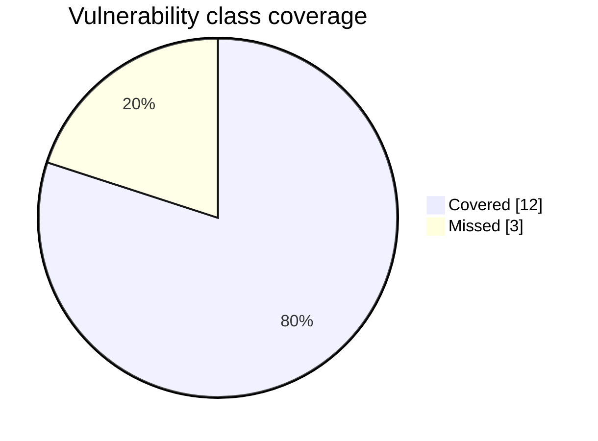
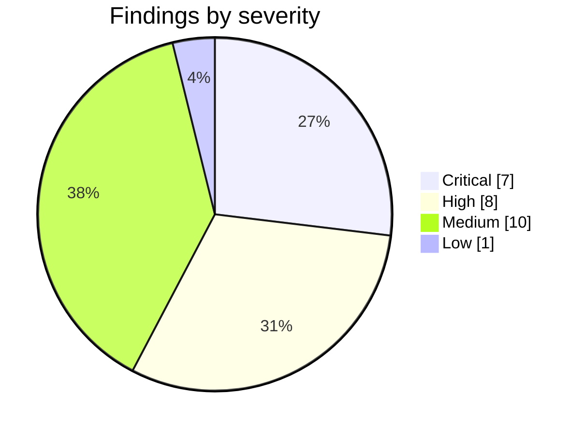

# ARCHON Black Box Benchmark

**Target:** OWASP Juice Shop  ·  `http://<target-host>:3000`  ·  2026-07-02

ARCHON was pointed at a fresh OWASP Juice Shop instance with no prior knowledge and asked to
perform a full black box web application penetration test. Juice Shop is a deliberately
vulnerable application, which makes it a stable yardstick: the benchmark measures how many of the
vulnerability classes it is known to contain ARCHON surfaces on its own, and how deeply.

## Coverage at a glance

```
class coverage   ███████████████████░░░░░  80%   (12 of 15 classes)
```

| Metric | Value |
|---|---|
| Confirmed findings on the board | **26** |
| Critical / High / Medium | 7 / 8 / 10 |
| Vulnerability classes covered | **12 of 15** (80%) |
| Additional findings beyond the classes | 14 |



## Findings by severity

ARCHON confirmed **26** findings, weighted heavily toward high impact issues.



## Class scorecard

Each vulnerability class Juice Shop is known to contain, and whether ARCHON surfaced at least one
confirmed finding for it. Matching is by CWE, OWASP tag, or keyword.

| Vulnerability class | Result | Representative finding |
|---|:--:|---|
| SQL Injection | 🟢 found | SQL Injection Authentication Bypass — Unauthenticated Admin JWT  |
| Cross Site Scripting | 🟢 found | Stored XSS via Unauthenticated PUT /rest/products/{id}/reviews — |
| Broken authentication, weak or default credentials, no rate limit | 🟢 found | JWT Algorithm Confusion — alg:none Accepted — Unauthenticated Ad |
| Broken access control and IDOR | 🟢 found | Mass Assignment — Unauthenticated Admin and Deluxe Role Self-Ass |
| Sensitive data and information exposure | 🟢 found | JWT RS256-to-HS256 Algorithm Confusion — Exposed Public Key Used |
| Path traversal and LFI | 🟢 found | Stack Trace and Framework Version Disclosure on Error Responses |
| JWT weaknesses | 🟢 found | Password Change Without Current Password Verification — Account  |
| Cross Site Request Forgery | 🟢 found | CORS Wildcard on All API Endpoints — Any Origin Can Read API Res |
| Unvalidated or open redirect | 🔴 missed |  |
| Server Side Request Forgery | 🔴 missed |  |
| XML External Entity | 🟢 found | XXE In-Band File Read via Unauthenticated POST /file-upload — Ar |
| Security misconfiguration, missing headers, CORS | 🟢 found | Missing Security Headers — No HSTS, No CSP, No Referrer-Policy |
| Other injection | 🟢 found | Server-Side JavaScript Injection (SSJI) via safeEval on B2B Orde |
| Vulnerable or outdated components | 🔴 missed |  |
| Improper input validation and business logic abuse | 🟢 found | Business Logic — Negative Quantity and Price Manipulation at Bas |

## What ARCHON found

ARCHON covered **12 of 15** classes and reported **26**
confirmed findings, 14 of them beyond a single example per class. The depth matters:
it did not simply tick a box per class, it independently reproduced multiple distinct instances,
including SQL injection authentication bypass, union based injection in product search, JWT
algorithm confusion and the alg none bypass, stored cross site scripting, mass assignment leading
to administrator self registration, and exposed cryptographic key material. Every high impact class
that leads to account takeover or data compromise was surfaced.

Classes covered: sqli, xss, broken_auth, access_control, sensitive_data, path_traversal, jwt, csrf, xxe, security_misconfig, injection_other, input_validation.

## What ARCHON missed

ARCHON did not surface a confirmed finding for 3 classes: open_redirect, ssrf, vulnerable_components. These are the harder to reach or lower signal classes in a pure black box run: open redirect and server side request forgery need a specific reachable sink, XML external entity depends on hitting the file import surface, NoSQL and command injection sit behind less obvious endpoints, and outdated component detection favours a source or dependency view. They are candidates for a focused follow up pass or a white box run.

## Reading the score

The headline number is class level coverage, not a count of the roughly one hundred individual
Juice Shop challenges. A class counts as covered when at least one confirmed finding maps to it, so
the score stays stable across Juice Shop versions and rewards genuine discovery rather than the
exact challenge names. The 14 additional findings show that within the covered
classes ARCHON went several instances deep, which is closer to how a real assessment reads than a
single proof of concept per category.
