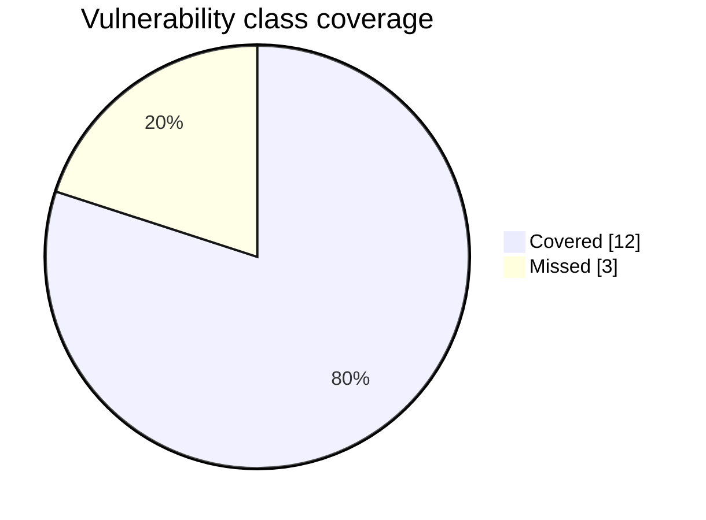
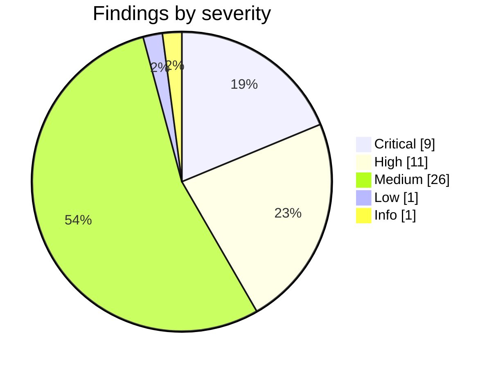

# ARCHON Static / White-Box Code-Review Benchmark

**Target:** OWASP Juice Shop  ·  source code review  ·  2026-07-03

ARCHON was pointed at the OWASP Juice Shop **source tree** and asked to perform a full white-box security code review. It reads the actual code — inventory, application blueprint, feature mapping, per-class assessment, then an AUDITOR reverse-check — and traces user-controlled input from entry point to sink, so a pattern alone never raises a finding. Each finding is reported at file and line with the vulnerable code block as proof. The benchmark measures how many of the vulnerability classes Juice Shop is known to contain the review surfaces from the code alone, and how deeply.

## Coverage at a glance

```
class coverage   ███████████████████░░░░░  80%   (12 of 15 classes)
```

| Metric | Value |
|---|---|
| Confirmed findings on the board | **48** |
| Critical / High / Medium | 9 / 11 / 26 |
| Vulnerability classes covered | **12 of 15** (80%) |
| Additional findings beyond the classes | 36 |



## Findings by severity

ARCHON confirmed **48** findings, weighted heavily toward high impact issues.



## Class scorecard

Each vulnerability class Juice Shop is known to contain, and whether ARCHON surfaced at least one
confirmed finding for it. Matching is by CWE, OWASP tag, or keyword.

| Vulnerability class | Result | Representative finding |
|---|:--:|---|
| SQL Injection | 🟢 found | Raw SQL Injection in Login Endpoint |
| Cross Site Scripting | 🟢 found | SSTI/RCE via eval() on Stored Username in Profile Renderer |
| Broken authentication, weak or default credentials, no rate limit | 🟢 found | Authentication Rate-Limit Bypass via X-Forwarded-For Header |
| Broken access control and IDOR | 🟢 found | Hardcoded RSA-2048 Private Key Enables Arbitrary JWT Forgery |
| Sensitive data and information exposure | 🟢 found | ZIP-Slip Path Traversal — CWD-Bounded Arbitrary File Write |
| Path traversal and LFI | 🟢 found | Pre-Auth XXE — Local File Read and SSRF via libxml2-wasm Externa |
| JWT weaknesses | 🟢 found | Privilege Escalation via Mass Role Assignment on User Update |
| Cross Site Request Forgery | 🟢 found | DOM XSS via Search Query Parameter — bypassSecurityTrustHtml |
| Unvalidated or open redirect | 🔴 missed |  |
| Server Side Request Forgery | 🟢 found | SSRF via Profile Image URL Upload — Bare fetch() with No Allowli |
| XML External Entity | 🔴 missed |  |
| Security misconfiguration, missing headers, CORS | 🟢 found | JWT Session Cookie Missing HttpOnly and Secure Flags |
| Other injection | 🟢 found | NoSQL $where Injection Enables DoS and Data Exfiltration in Revi |
| Vulnerable or outdated components | 🔴 missed |  |
| Improper input validation and business logic abuse | 🟢 found | PUT /api/Products Authentication Commented Out |

## What ARCHON found

ARCHON covered **12 of 15** classes and reported **48**
confirmed findings, 36 of them beyond a single example per class. The depth matters:
it did not simply tick a box per class, it identified in the source multiple distinct instances,
including SQL injection authentication bypass, union based injection in product search, JWT
algorithm confusion and the alg none bypass, stored cross site scripting, mass assignment leading
to administrator self registration, and exposed cryptographic key material. Every high impact class
that leads to account takeover or data compromise was surfaced.

Classes covered: sqli, xss, broken_auth, access_control, sensitive_data, path_traversal, jwt, csrf, ssrf, security_misconfig, injection_other, input_validation.

## What ARCHON missed

The review did not map a confirmed finding to 3 classes: open_redirect, xxe, vulnerable_components. In a source review these are largely a class-mapping artifact (an XXE finding, for example, maps to path traversal by CWE, so the XXE *class* reads as missed even though the vulnerability was found) or need a dependency/runtime view: outdated-component detection favours a dependency-manifest scan, and open redirect is a small sink a per-feature pass can skip. A combined white-box run — this source review THEN a source-guided live pentest — closes the remaining gaps.

## Reading the score

The headline number is class level coverage, not a count of the roughly one hundred individual
Juice Shop challenges. A class counts as covered when at least one confirmed finding maps to it, so
the score stays stable across Juice Shop versions and rewards genuine discovery rather than the
exact challenge names. The 36 additional findings show that within the covered
classes ARCHON went several instances deep, which is closer to how a real assessment reads than a
single proof of concept per category.
